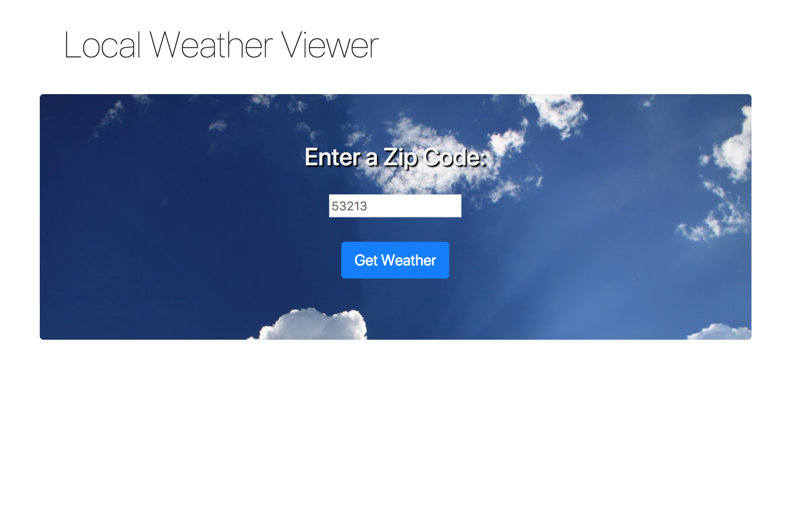
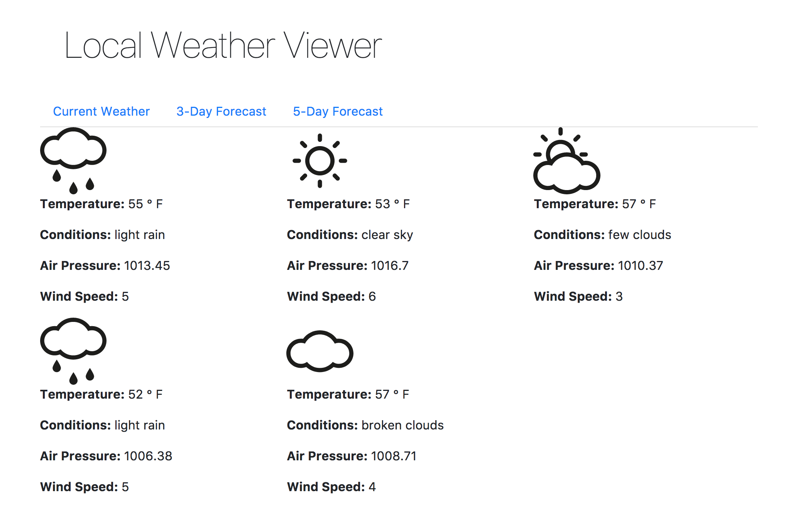

# Local Weather Viewer

With this app, a user can view current, 3-day, and 5-day forecasts for weather in any US zip code. 

The Local Weather Viewer uses the <a href="https://openweathermap.org/api">Open Weather Map API</a> to retrieve weather data. The user interface is created with Bootstrap 4, Sass and using SVG icons from <a href="http://www.alessioatzeni.com/meteocons/">Meteocons</a> triggered by API data. Jquery code is encapsulated using Browserify.




## Technologies Used

* jQuery
* Browserify
* Bootstrap 4
* Sass
* <a href="https://openweathermap.org/api">Open Weather Map API</a>

## Installation and Setup
__Loading Dependencies__:

1. Clone the Local Weather API repository
```
git clone https://github.com/jsheridanwells/local-weather-api.git
```

2. If you do not have Sass on your system, you will need to install it:
```
gem install sass
```

3. Change to the /lib directory
```
cd lib
```
4. Install all Node dependencies
```
npm install
```
5. Run Grunt. This will compile all stylesheets and javascripts to the css/styles.css and dist/app.js files. The app will also open in your browser on `localhost:3000`
```
grunt
```
Note that Grunt will fail the first time. You will need to create an api key file (instructions below) for Grunt to run successfully.

__Setting up the Open Weather Map API__:

In order for the Local Weather Viewer to work locally you will need to create a separate javascript file to hold your API key.

1. Follow the instructions at OpenWeatherMap.org for <a href="http://openweathermap.org/appid">registering and creating an api key.</a>

2. Once you have your API key, from the root directory, create the api javascript file: 
```
touch js/api.js
```
3. Copy the following contents into the api.js file, substituting your own API key on `[your API here]`: 
```
'use strict';
let api = '[your API here]';

//returns api key and url to api handlers in the application
function getAPI() {
	return {
		apiKey: api,
		url: 'https://api.openweathermap.org/'
	};
}

module.exports = getAPI;

```

## Author
  Jeremy Sheridan Wells
  
  [jeremywells.org](http://jeremywells.org)

  [Github: jsheridanwells](http://www.github.com/jsheridanwells)

  [Twitter: @jsheridanwells](http://twitter.com/jsheridanwells)
